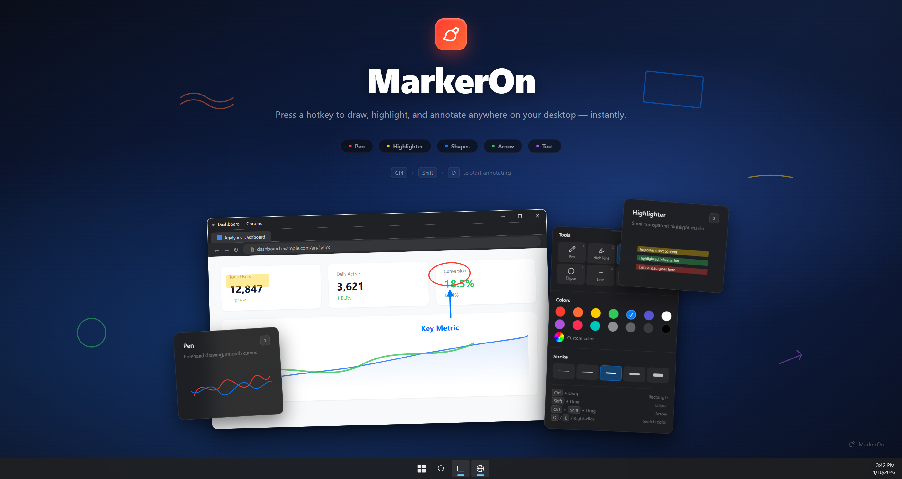
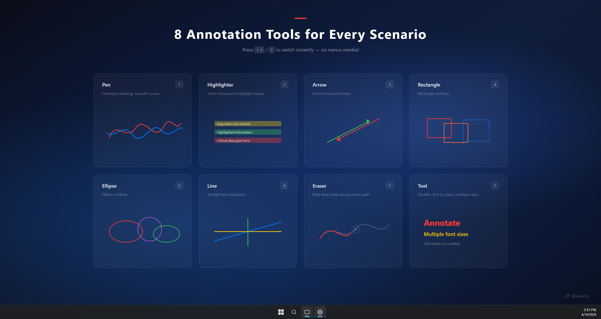
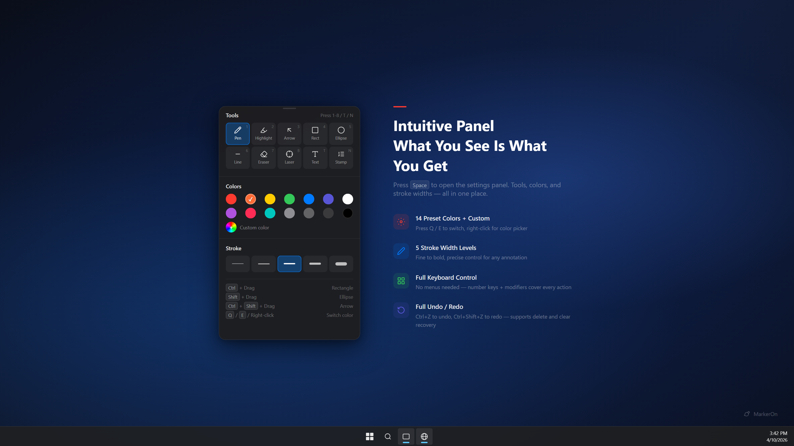

<div align="center">
  
  <h1>MarkerOn</h1>
  <p><strong>Lightweight screen annotation tool</strong> — press a hotkey to instantly draw, highlight, and annotate anywhere on your desktop.</p>
  <p>
    <a href="https://github.com/ifer47/markeron/actions/workflows/ci.yml"></a>
    <a href="https://github.com/ifer47/markeron/releases/latest"></a>
    <a href="https://github.com/ifer47/markeron/releases"></a>
    <a href="./LICENSE"></a>
    <a href="https://github.com/ifer47/markeron/stargazers"></a>
  </p>
  <p>
    <a href="./README_zh.md">中文</a>
  </p>
</div>

<p align="center">
  
</p>

## Download

<p>
  <a href="https://github.com/ifer47/markeron/releases/latest"></a>
  <a href="https://github.com/ifer47/markeron/releases/latest"></a>
  <a href="https://github.com/ifer47/markeron/releases/latest"></a>
  <a href="https://get.microsoft.com/installer/download/9n6623x973jv?referrer=appbadge"></a>
</p>

**[Download Latest Release](https://github.com/ifer47/markeron/releases/latest)** — pick the installer for your platform from the assets list.

## Features

- **Annotate anywhere** — draw over any app, including the taskbar
- **8 tools** — pen, highlighter, arrow, rectangle, ellipse, line, eraser, text
- **Intuitive panel** — press <kbd>Space</kbd> to toggle tools, colors, and stroke widths
- **Full keyboard control** — every action has a shortcut, no menus needed

<table>
<tr>
<td width="50%">

</td>
<td width="50%">

</td>
</tr>
</table>

## Keyboard Shortcuts

On **macOS**, use <kbd>Command</kbd> (⌘) in place of <kbd>Ctrl</kbd>, and <kbd>Option</kbd> (⌥) in place of <kbd>Alt</kbd>.

### Global Shortcuts

| Action | Windows | macOS |
| :--- | :--- | :--- |
| Toggle annotation mode | <kbd>Ctrl</kbd> + <kbd>Shift</kbd> + <kbd>D</kbd> | <kbd>Command</kbd> + <kbd>Shift</kbd> + <kbd>D</kbd> |
| Clear all annotations | <kbd>Ctrl</kbd> + <kbd>Shift</kbd> + <kbd>C</kbd> | <kbd>Command</kbd> + <kbd>Shift</kbd> + <kbd>C</kbd> |

### Tool Switching

| Key | Tool | Key | Tool |
| :---: | :--- | :---: | :--- |
| <kbd>1</kbd> | Pen | <kbd>5</kbd> | Ellipse |
| <kbd>2</kbd> | Highlighter | <kbd>6</kbd> | Line |
| <kbd>3</kbd> | Arrow | <kbd>7</kbd> | Eraser |
| <kbd>4</kbd> | Rectangle | <kbd>T</kbd> | Text |

### Common Actions

| Action | Windows | macOS |
| :--- | :--- | :--- |
| Settings panel | <kbd>Space</kbd> | <kbd>Space</kbd> |
| Copy screen | <kbd>Ctrl</kbd> + <kbd>C</kbd> | <kbd>Command</kbd> + <kbd>C</kbd> |
| Undo / Redo | <kbd>Ctrl</kbd> + <kbd>Z</kbd> / <kbd>Y</kbd> | <kbd>Command</kbd> + <kbd>Z</kbd> / <kbd>Y</kbd> |
| Clear all | <kbd>Delete</kbd> | <kbd>Delete</kbd> |
| Exit | <kbd>Esc</kbd> | <kbd>Esc</kbd> |

<details>
<summary><strong>All shortcuts</strong></summary>

#### Drawing with Modifier Keys

| Draws | Windows | macOS |
| :--- | :--- | :--- |
| Current tool (default: pen) | Drag | Drag |
| Line | <kbd>Alt</kbd> + Drag | <kbd>Option</kbd> + Drag |
| Rectangle | <kbd>Ctrl</kbd> + Drag | <kbd>Command</kbd> + Drag |
| Square | <kbd>Ctrl</kbd> + <kbd>Alt</kbd> + Drag | <kbd>Command</kbd> + <kbd>Option</kbd> + Drag |
| Ellipse | <kbd>Shift</kbd> + Drag | <kbd>Shift</kbd> + Drag |
| Circle | <kbd>Shift</kbd> + <kbd>Alt</kbd> + Drag | <kbd>Shift</kbd> + <kbd>Option</kbd> + Drag |
| Arrow | <kbd>Ctrl</kbd> + <kbd>Shift</kbd> + Drag | <kbd>Command</kbd> + <kbd>Shift</kbd> + Drag |

#### Edit & Move

| Action | Effect |
| :--- | :--- |
| Hover over an element and drag | **Move** the element (enable "Allow dragging existing elements" in settings) |
| Double-click existing text | Re-enter **edit mode** for that text |
| Double-click empty area in <kbd>T</kbd> mode | Create a new text input at cursor position |

#### Color Switching

| Action | Effect |
| :--- | :--- |
| <kbd>Q</kbd> / <kbd>E</kbd> | Previous / Next color |
| Right-click | Open quick color picker at cursor |

#### Other

| Action | Windows | macOS |
| :--- | :--- | :--- |
| Redo (alt) | <kbd>Ctrl</kbd> + <kbd>Shift</kbd> + <kbd>Z</kbd> | <kbd>Command</kbd> + <kbd>Shift</kbd> + <kbd>Z</kbd> |
| Switch window & exit | <kbd>Alt</kbd> + <kbd>Tab</kbd> | <kbd>Command</kbd> + <kbd>Tab</kbd> |

</details>

## Quick Start

```bash
npm install
npm run dev
npm run build
```

After launching, the app runs silently in the **system tray** with no window shown.

## Tech Stack

| Technology | Role |
| :--- | :--- |
| **Tauri v2** | Desktop framework — Rust backend, system tray, global shortcuts, transparent always-on-top window |
| **Vue 3** | Frontend UI framework |
| **Vite** | Fast bundling and HMR |
| **TypeScript** | Full type safety |
| **Canvas API** | High-performance drawing engine |

<details>
<summary><strong>Project structure</strong></summary>

```
markeron/
├── src-tauri/
│   ├── src/
│   │   └── lib.rs               # Rust backend — window management, shortcuts, tray
│   └── tauri.conf.json          # Tauri configuration
│
├── src/
│   ├── components/
│   │   ├── DrawingOverlay.vue   # Drawing overlay (Canvas + interactions)
│   │   ├── SettingsPanel.vue    # Annotation toolbar (tool / color / stroke)
│   │   ├── SettingsView.vue     # Settings window (shortcut config / sidebar layout)
│   │   └── TextBox.vue          # Inline text input
│   ├── composables/
│   │   └── useDrawing.ts        # Drawing engine (pen, shapes, text, undo/redo)
│   ├── types/
│   │   └── app.d.ts             # TypeScript type declarations
│   ├── App.vue                  # Root component
│   ├── main.ts                  # Renderer entry point
│   └── style.css                # Global styles
│
├── index.html                   # HTML entry
├── vite.config.ts               # Vite configuration
└── package.json
```

</details>

## License

[MIT](./LICENSE)
