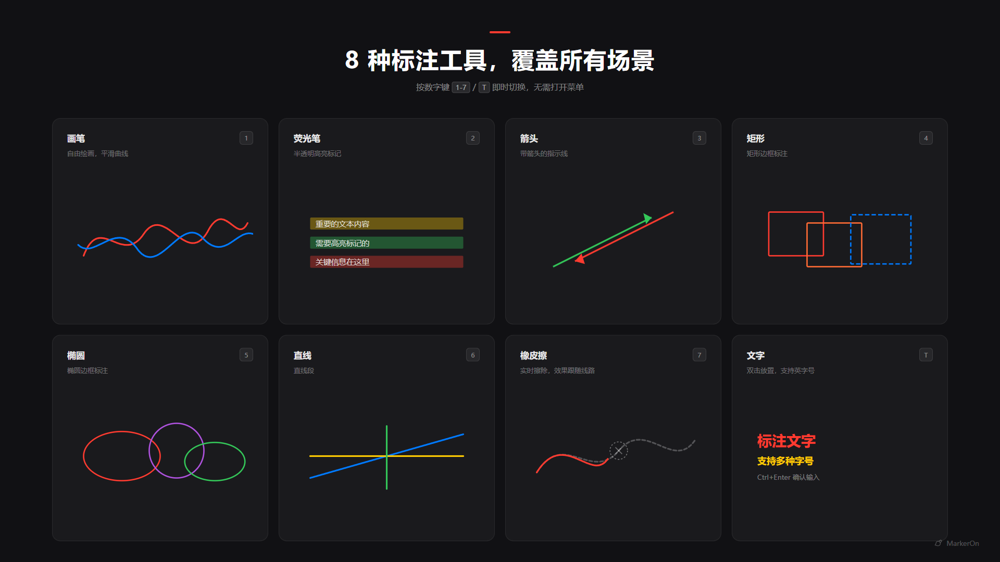
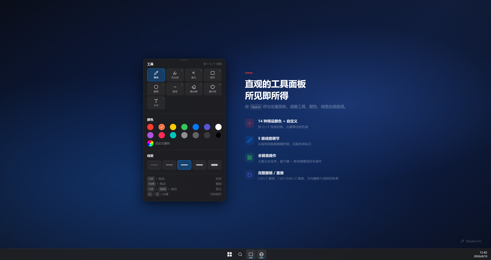

<div align="center">
  
  <h1>MarkerOn</h1>
  <p>
    <a href="./README.md">English</a>
  </p>
  <p>
    <a href="https://github.com/ifer47/markeron/actions/workflows/ci.yml"></a>
    <a href="https://github.com/ifer47/markeron/releases/latest"></a>
    <a href="https://github.com/ifer47/markeron/releases"></a>
    <a href="./LICENSE"></a>
    <a href="https://github.com/ifer47/markeron/stargazers"></a>
    <a href="https://markeron.cn/"></a>
    <a href="https://afdian.com/a/markeron"></a>
  </p>
  <p><strong>轻量级屏幕标注工具</strong>（~1.5 MB）— 按下快捷键（<strong>快捷键优先</strong>），随时在桌面上自由绘画、标注。适用于课堂演示 / 会议讲解 / 录屏批注。<strong>免费开源。</strong>如果 MarkerOn 在你的演示、教学或会议中帮到了你，欢迎 <a href="https://afdian.com/a/markeron"><strong>在爱发电赞助</strong></a>，每一份支持都有助于项目的持续维护。</p>
</div>


<p align="center">
  
</p>

**目录：** [下载安装](#下载安装) · [快速开始](#快速开始) · [功能一览](#功能一览) · [快捷键](#快捷键一览) · [反馈](#反馈与-issue) · [开发构建](#开发构建)

## 下载安装

<p>
  <a href="https://github.com/ifer47/markeron/releases/latest"></a>
  <a href="https://github.com/ifer47/markeron/releases/latest"></a>
  <a href="https://github.com/ifer47/markeron/releases/latest"></a>
  <a href="https://github.com/ifer47/markeron/releases/latest"></a>
  <a href="https://get.microsoft.com/installer/download/9n6623x973jv?referrer=appbadge"></a>
</p>

**[下载最新版本](https://github.com/ifer47/markeron/releases/latest)** — 在 Assets 列表中选择对应平台的安装包下载。

Windows 用户也可以通过 WinGet 安装微软商店版本：

```powershell
winget install --id 9N6623X973JV --source msstore
```

> 官方下载渠道为 GitHub Releases 和微软商店。第三方镜像或网盘可能版本滞后，或存在被重新打包的风险。

## 快速开始

1. **安装并启动** — MarkerOn 在 **系统托盘** 静默运行，不会弹出窗口。
2. **进入标注模式** — 按 <kbd>Ctrl</kbd> + <kbd>Shift</kbd> + <kbd>D</kbd>（macOS 为 <kbd>Command</kbd> + <kbd>Shift</kbd> + <kbd>D</kbd>）。
3. **绘画与穿透** — 数字键切换工具；按 <kbd>X</kbd> 可在保留标注的同时操作下层应用；按 <kbd>Esc</kbd> 退出。

> **刚上手？** 按 <kbd>Space</kbd> 呼出工具栏。完整列表见 [快捷键一览](#快捷键一览)。

## 功能一览

- **轻量高效** — 安装包仅 ~1.5 MB（Rust + Canvas），内存占用极低，不驻留后台进程
- **随处标注** — 在任何应用上方绘制，覆盖全屏包括任务栏
- **8 种工具** — 画笔、荧光笔、箭头、矩形、椭圆、直线、橡皮擦、文字
- **灵活工具栏** — 按 <kbd>Space</kbd> 呼出，或在设置中**常驻显示**；紧凑面板，点「更多」展开完整选项，面板内可撤销、复制、切换白板；**独立浮动窗口**，含绘制 / 穿透模式切换按钮
- **穿透模式** — 标注会话中可点击下层应用；工具栏按钮、<kbd>Ctrl</kbd>+<kbd>Shift</kbd>+<kbd>X</kbd>（全局）或 <kbd>X</kbd>（绘制中）切换；白板模式下不可用
- **全键盘操控** — 每个操作都有快捷键，无需菜单
- **保留标注** — 可在「白板与内容」中开启退出后保留；下次进入自动恢复
- **白板模式** — 可设为默认进入白板，或按 <kbd>W</kbd> 切换；内容与切换行为均在「白板与内容」中配置
- **白板复制** — 在白板模式下按 <kbd>Ctrl</kbd>/<kbd>Command</kbd> + <kbd>C</kbd> 可复制当前白板为图片

<p align="center">
  
  <br />
  <em>随处绘画，按 <kbd>X</kbd> 穿透到下层应用操作，标注不丢失，讲解不中断。</em>
</p>

<table>
<tr>
<td width="50%">

</td>
<td width="50%">

</td>
</tr>
</table>

## 快捷键一览

在 **macOS** 上，<kbd>Ctrl</kbd> 对应 <kbd>Command</kbd>（⌘），<kbd>Alt</kbd> 对应 <kbd>Option</kbd>（⌥）。

### 全局快捷键

| 功能 | Windows | macOS |
| :--- | :--- | :--- |
| 开启 / 退出标注模式 | <kbd>Ctrl</kbd> + <kbd>Shift</kbd> + <kbd>D</kbd> | <kbd>Command</kbd> + <kbd>Shift</kbd> + <kbd>D</kbd> |
| 清除所有标注 | <kbd>Ctrl</kbd> + <kbd>Shift</kbd> + <kbd>C</kbd> | <kbd>Command</kbd> + <kbd>Shift</kbd> + <kbd>C</kbd> |
| 切换穿透模式 | <kbd>Ctrl</kbd> + <kbd>Shift</kbd> + <kbd>X</kbd> | <kbd>Command</kbd> + <kbd>Shift</kbd> + <kbd>X</kbd> |

### 工具切换

| 按键 | 工具 | 按键 | 工具 |
| :---: | :--- | :---: | :--- |
| <kbd>1</kbd> | 画笔 | <kbd>5</kbd> | 椭圆 |
| <kbd>2</kbd> | 荧光笔 | <kbd>6</kbd> | 直线 |
| <kbd>3</kbd> | 箭头 | <kbd>7</kbd> | 橡皮擦 |
| <kbd>4</kbd> | 矩形 | <kbd>T</kbd> | 文字 |

### 常用操作

| 功能 | Windows | macOS |
| :--- | :--- | :--- |
| 呼出工具栏 | <kbd>Space</kbd> | <kbd>Space</kbd> |
| 穿透模式（绘制中） | <kbd>X</kbd> | <kbd>X</kbd> |
| 工具栏常驻 / 布局 | 设置 → 常规 | 设置 → 常规 |
| 复制屏幕 / 白板 | <kbd>Ctrl</kbd> + <kbd>C</kbd> | <kbd>Command</kbd> + <kbd>C</kbd> |
| 白板模式切换 | <kbd>W</kbd> | <kbd>W</kbd> |
| 撤销 / 重做 | <kbd>Ctrl</kbd> + <kbd>Z</kbd> / <kbd>Y</kbd> | <kbd>Command</kbd> + <kbd>Z</kbd> / <kbd>Y</kbd> |
| 调整线宽 | <kbd>Ctrl</kbd> + 滚轮 | <kbd>Command</kbd> + 滚轮（画笔与形状共用；荧光笔/橡皮擦/文字各自独立） |
| 清除全部 | <kbd>Delete</kbd> | <kbd>Delete</kbd> |
| 退出标注 | <kbd>Esc</kbd> | <kbd>Esc</kbd> |

<details>
<summary><strong>全部快捷键</strong></summary>

#### 修饰键绘制

| 绘制内容 | Windows | macOS |
| :--- | :--- | :--- |
| 当前工具（默认画笔） | 拖动 | 拖动 |
| 直线 | <kbd>Alt</kbd> + 拖动 | <kbd>Option</kbd> + 拖动 |
| 矩形 | <kbd>Ctrl</kbd> + 拖动 | <kbd>Command</kbd> + 拖动 |
| 正方形 | <kbd>Ctrl</kbd> + <kbd>Alt</kbd> + 拖动 | <kbd>Command</kbd> + <kbd>Option</kbd> + 拖动 |
| 椭圆 | <kbd>Shift</kbd> + 拖动 | <kbd>Shift</kbd> + 拖动 |
| 正圆 | <kbd>Shift</kbd> + <kbd>Alt</kbd> + 拖动 | <kbd>Shift</kbd> + <kbd>Option</kbd> + 拖动 |
| 箭头 | <kbd>Ctrl</kbd> + <kbd>Shift</kbd> + 拖动 | <kbd>Command</kbd> + <kbd>Shift</kbd> + 拖动 |

#### 编辑与移动

| 操作 | 功能 |
| :--- | :--- |
| 元素拖拽 | 在「常规」设置中选择：**关闭** / **悬停拖动** / **按住 Ctrl 才拖动** |
| 双击已有文字 | 重新进入该文字的**编辑模式** |
| <kbd>T</kbd> 模式下双击空白处 | 在光标位置新建文字输入框 |

#### 颜色切换

| 操作 | 功能 |
| :--- | :--- |
| <kbd>Q</kbd> / <kbd>E</kbd> | 上一个 / 下一个颜色 |
| 鼠标右键 | 在光标处弹出快速选色盘 |

#### 其他

| 功能 | Windows | macOS |
| :--- | :--- | :--- |
| 重做（备用） | <kbd>Ctrl</kbd> + <kbd>Shift</kbd> + <kbd>Z</kbd> | <kbd>Command</kbd> + <kbd>Shift</kbd> + <kbd>Z</kbd> |

</details>

<details>
<summary><strong>更多设置</strong></summary>

在 **设置 → 常规** 中可配置（工具栏显示、穿透模式、线宽等见 [功能一览](#功能一览)）：

- **白板与内容** — 默认进入（屏幕标注 / 白板）、退出标注后保留、按 <kbd>W</kbd> 切换时保留
- **元素拖拽** — 关闭、悬停拖动，或按住 <kbd>Ctrl</kbd>/<kbd>Command</kbd> 才拖动（橡皮擦工具下不触发）
- **橡皮擦模式** — 轨迹擦除（局部）或对象擦除（划过删除整段元素）
- **吸附角度步进** — 按住 <kbd>Alt</kbd> 绘制直线时的吸附角度间隔
- **开机自动启动** — 系统启动时自动在后台运行

</details>

## 反馈与 Issue

- **报 Bug：** 设置 → **诊断** → 导出报告，再到 [GitHub Issues](https://github.com/ifer47/markeron/issues) 提交
- **隐私政策：** [PRIVACY.md](./PRIVACY.md)

## 开发构建

详见 [CONTRIBUTING.md](./CONTRIBUTING.md)（环境依赖、搭建与完整流程）。**技术栈：** Tauri v2 · Vue 3 · Vite · TypeScript · Canvas API
